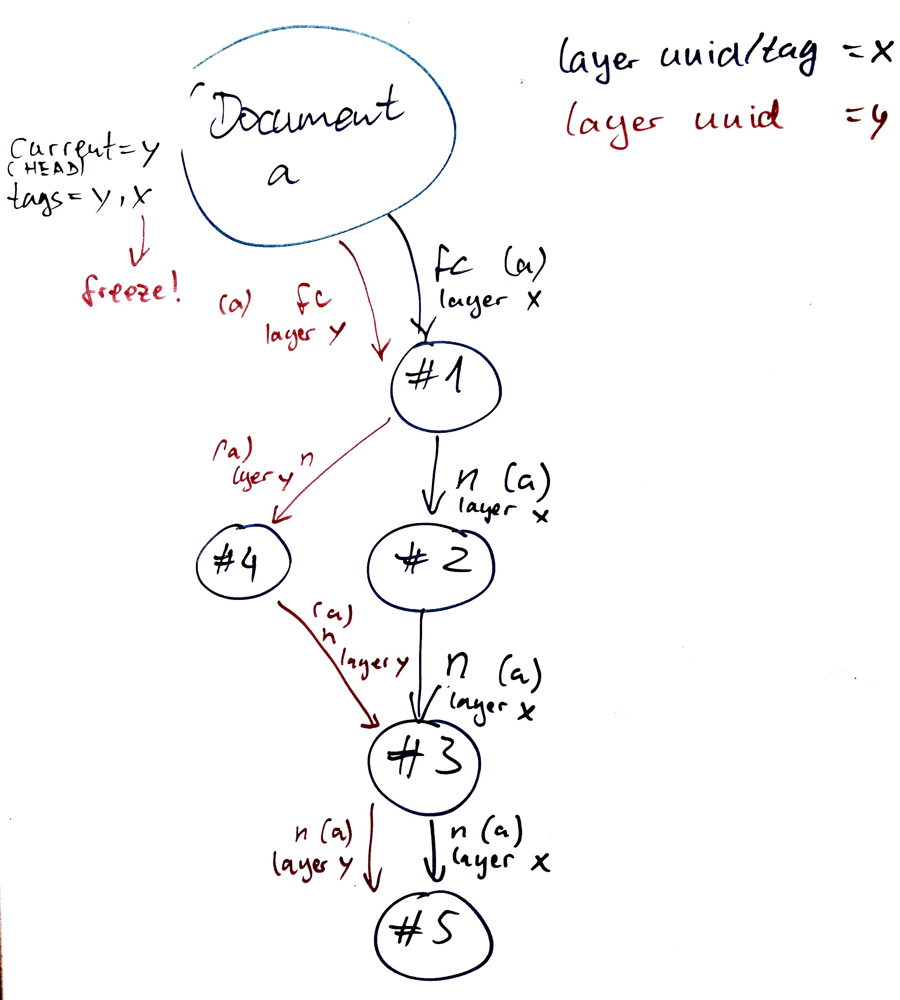
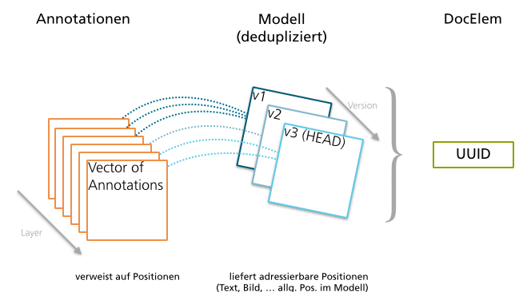

# Design of the Documentelement Store

Design of the Documentelement Store as _microservice_,
current prototype is primary based on _Akka_ and _OrientDB_.

## Basic API

Jede Instanz (z.B. Pipelet, Besucher etc.) erhält ihren eigenen `store`-Aktor.

    // ask pattern
    docelem = store ? Get(uuid)

Jede Nachricht kann noch von `Version(msg, nr|id|date)` ummantelt werden,
falls eine spezifische Version angefordert werden soll.

    docelem ! Edit(change)

#### Templating (Projektionen, Transformatoren, Generatoren)

Das Templating-Modul sollte mittelfristig in einen extra Templating Service
ausgelagert werden!

    // ask pattern
    projectedModel = docelem ? Projection(Html)
    projectedModel = docelem ? Projection(Raw)
    projectedModel = docelem ? Version(Projection(Html), "ef8i")

Templates sind selbst wieder Dokumentelemente.
Das Templating-Modul erhält das Template und das Modell bzw.
die Modell-Attribute des Ziel-Dokumentelements, um daraus
die gewünschte Projektion zu erstellen.

Irgendwo muss konfiguriert werden, welche Dokumentelement-Typen
mit welchen Template-Dokumentelementen gerendert werden können.
Man kann darüber nachdenken, diese Mappings ebenfalls
als Dokumentelement(e) zu hinterlegen.

#### Annotationen

Eine Annotation ist eine Beziehung von zu einem Dokumentelement.
Jede Annotation hat einen Zweck.
Jede Annotation kann ein eine bestimmte Position gesetzt werden,
und ggf. weitere Eigenschaften besitzen.
Jede Annotation sollte einem (Annotations-)Layer zugeornet werden.
Ein Annotationslayer ist wieder ein (Meta-)Dokumentelement.
Darüber kann ermittelt werden, wer diese Annotationen geschrieben hat;
ein Satz unerwünschter Annotationen können leicht entfernt werden;
verschiedene Versionen eines Dokumentelements können eigene Annotationen besitzen.

Beispiel: In einem Paragraph wird ein Teil des Textes mit einem Kommentar versehen.
Zweck ist die Kommentierung und der Kommentar selbst kann z.B. wieder ein Paragraph-Dokumentelement sein.

    docelem ! GetAnnotations(query)
    docelem ! AnnotateWith(uuid|docelem, purpose, position, layer, props)

(In OrientDB kann man `purpose` dann als Kantentyp modellieren.)

Beispiele für `query` sind:

  * gib mir alle Annotationen mit Provanance name=Sven
  * gib mir alle Annotationen
  * gib mir die ersten 10 Annotationen vom Typ Konzept namespace="HGNC"

#### Provenance

Provenance Kanten zeigt immer auf einen Urheber (Autoren, Co-Autoren, Programme).
Der Urheber wird durch ein Dokumentelement repräsentiert,
z.B. ein Dokumentelement vom Typ Person mit z.B. einem vCard-Modell.

    docelem ! GetProvanance(query)
    docelem ! OfProvenance(creator, position)

Im Prinzip ist die Provenance nur ein Spezialfall einer Annotation.
Es ist eine vom System vordefinierte Annotation mit dem Zweck
die Herkunft zu annotieren.

Weiteres Attribut könnte `importer` und `source` sein.
Beispiel: DocElem -prov-> creator: Author Name, source: Medline, importer: shodapp...

??? Der Prototyp wird zeigen, ob Provenance nicht sogar als eigener DocElem-Typ modelliert werden sollte.
Vermutlich ist das sogar sinnvoller!

#### Topologie (Korpus)

Im Prinzip sind die Topologie-Kanten ebenfalls wieder nur Spezialfälle
der Annotation.

Die Topologie-Kanten zeigen immer auf andere Dokumentelemente.
Es gibt zwei Arten von Topologie-Kanten:

  * First Child
  * Next

Zudem gibt es noch ein Dokumentelement vom Typ `Root` oder `Document`,
welches den Beginn eines Dokumenten-Korpus darstellt.
Zudem können dort noch weitere Meta-Informationen zum Dokument gesammelt werden.
(Im DocElem-Modell, den Modell-Attributen oder als Annotationen)

Damit kann ein abstrakter Syntaxbaum repräsentiert werden.
Dadurch, dass ein Dokumentelement eventuell in mehreren Dokument-Korpera
vorkommen kann, gibt es noch weitere Properties auf den Kanten:

  * belongs_to/corpus: uuid des Root-DocElems
  * is_cited: true / version-nr (des zitierten DocElem)
  * layer: id

Wenn `is_cited` aktiv ist, gilt das nächste Dokumentelement als zitiert
aus einem anderen Dokument.
Ein aktives `is_cited` erfordert, dass auf eine bestimmte Version des
Dokumentelements zitiert wird.

Anhand der `layer` werden die verschiedenen Versionen des gesamten
Dokumentenkorpus festgehalten. (Markierung einer Ausgabe/Edition eines Dokuments.)

Man kann natürlich auch von jedem Dokumentelement ausgehend die Topologie
ablaufen. Nur muss dann dazu die Angabe gemacht werden, zu welchem
Dokument die Topologie angezeigt werden soll.
Das ist nützlich wenn man z.B. einen Teilausschnitt eines Dokuments
betrachten will.

###### Topologie API

    docelem ? GetNextSibling(to=uuid, corpus=uuid_root_elem)
    docelem ? GetFirstChild(to=uuid, corpus=uuid_root_elem)
    docelem ? GetPreviousSibling(to=uuid, corpus=uuid_root_elem)
    docelem ? GetParent(to=uuid, corpus=uuid_root_elem)

## Versionsmanagement

TODO: Unterteilen in Model-Versionierung und Annotations-Versionierung!

Dokumentelemente mit Versionen sind quasi mehrdimensionale Dokumentelemente.
Jedes Dokumentelement hat einen Vektor/Liste wo die Vergangenheit des
Modells gespeichert ist (Verweis auf Modell-Id oder Modell selbst).
Der HEAD der Liste ist immer die aktuellste Version.
Ein named-tag ist ein Verweis auf eine spezifische Version (List-Item),
die ein Autor gerne als einen signifikaten Punkt markiert.

Es sollte vorgesehen sein, dass man mehrere Annotationslayer
gleichzeitig anschauen kann. Eventuell auch Annotationslayer einer
anderen Version sollten betrachtbar sein. (Wenn man z.B. den Annotated String
(Positionen werden Konstant) implementiert hat, kann das nützlich sein!)

Versionierung der Annotationen (also der Kanten) geschieht über
die Annotationslayer.
Ein Annotationslayer ist einer spezifischen Version des Dokumentelements
zugeordnet.
Wird z.B. eine Version eines gesamten Dokuments "getaggt",
so werden die betroffenen Annotationslayer am besten eingefrohren
und damit nicht mehr veränderbar gemacht.

Ein Annotationslayer kann z.B. von einer Person oder von Programm stammen.
Es sollte aber auch möglich sein, ein Dokumentelement in seiner Gesamtheit
(also Versionsunabhängig) annotieren zu können.
Das kann nützlich sein, wenn man z.B. ein Dokumentelement in eine Art "Ordner"
packen will. (Ähnlich wie ein Bild in mehren Photoalben vorkommen kann.)

TODO Discuss: Das Modell eines Dokumentelements kann unter Umständen z.B. in mehreren
Dokumenten-Korpera vorkommen. Eventuell kann es sich in verschiedene Richtungen
entwickeln. Daher könnte es nützlich sein, von Anfang an ein BRANCHING-Konzept
beim Versionsmanagement zu berücksichtigen.
Ein Branch wäre dann vergleichbar mit einem Annotationslayer.
Eine Alternative zum Branch wäre eine tiefe Kopie -> neues Dokumentelement...

    VERSION/Key = {HASH, DATETIME-UTC, BRANCH}, MODEL|MODEL-BLOB, provenance?

    0af  11:11  master  $UUID  "Hallo"
    f0a  11:15  master  $UUID  "Hallo Welt"
    ffa  11:16  master  $UUID  "Hallo Welt!"
    ...

    Pseudo-Query um die aktuellste Version zu erhalten:
    select from Versions where UUID=? and order by RID desc skip 0 limit 1

#### Konflikte über Annotationen behandeln

Wenn Autor und Co-Autoren gleichzeitig am gleichen Dokumentelement arbeiten,
kann es zu Konflikten kommen.

Beispiel:

  * Ursprung Model: "Hallo"
  * Autoren bearbeiten gleichzeitig:
    * A: "Hallo" -> "Hallo Welt"
    * B: "Hallo" -> "Hallo schöne Welt"
  * Es tritt ein Konflikt auf!
  * Statt eine neue Version für das Dokumentelement herauszugeben,
    wird das langsamere Update (hat also MVC Error) als ein neues
    (temporäres) Dokumentelement verpackt und als z.B. `resolve_conflict`
    an das Dokumentelement annotiert. (z.B. sogar mit Merge-Vorschlägen;
    im Prinzip kann das wie "kurieren" behandelt werden.)

Dieses Prinzip ist  für Batch-Processing gut geeignet.

#### Konflikte Live behandeln

Der Modell-Editor des Dokumentelements bringt eine Live-Ansicht mit und übernimmt die Merges.
Bei Text könnte es so aussehen, dass alle Autoren sich den gleichen Dokumentelement-Aktor
teilen und diesem Nachrichten schicken.
Sobald der Aktor Änderungen feststellt, werden alle anderen verbundenen Autoren
sofort informiert. Bei Text zeigt Google Docs wie das funktionieren kann.

Dieses Prinzip ist mehr "responsive" und daher eher für den direkten User-Input geeignet.

## Nutzermanagement

Die feinst granulierten Rechte kann ich mir bei einem Dokument wie folgt vorstellen:

  * None
  * Read
    * cite
    * annotate (comments, tags)
  * Write
    * proofread (Lektor)
    * curate (Domain-Experte)
    * edit (Autor, Co-Autor)

Diese Rechte sollen auf Dokumentelement-Ebene ausgeführt werden.
Rechte zeigen immer auf eine Gruppe von Personen.

#### API

Den `token` sollte der Benutzer zuvor von einem speziellen
Authentification Service besorgen.

    store ! Auth(token)

Darauf hin kann der `store` ebenfalls einen Authentification Service anrufen,
um den `token` auf Gültigkeit zu prüfen und zugehörigen Benutzer zu erfahren.

Fordert der Benutzer ein Dokumentelement an auf das er keinen Lesezugriff hat,
antwortet das Dokumentelement statt z.B. mit dem Inhalt mit "no read permission on ${uuid}".

    docelem ! ChRights(group, "+e")

#### Datenstruktur

Es gibt Benutzer-Dokumentelemente, z.B. haben diesen ein vCard-Modell.
Es gibt Gruppen-Dokumentelemente welche Benutzer annotiert haben.
Die erste Gruppe die es gibt ist "Everybody" zu der jeder Benutzer (auch anonyme) gehört.

Kanten auf Dokumentelement mit den Eigenschaften:

  * DocElem `-- rights -->` Gruppe
  * Properties wie o.g.
  * Diese Kanten werden nicht versioniert! Es gilt immer nur die aktuellste;
    Sonst könnte man z.B. eine Veröffentlichung nicht mehr Rückgängig machen!

??? Ist es sinnvoll die Rechte getrennt von den eigentlichen Daten zu halten?

## Deduplizierung

Grundsätzlich geht es darum, doppelte Importe von Dokumentelementen und
ggf. von Annotationen zu vermeiden.

Das bedeutet es muss vor dem Import eine ID erzeugt werden,
welche vom Modell-Inhalt abhängt (HASH).

Beim ersten Erzeugen wird eine zufällige UUID (mit URI) erzeugt,
als ID für das Dokumentelement.

  1. Man kennt keine UUID, nur das Modell. Es existiert auch noch keine UUID und diese muss erzeugt werden.
  2. Man kennt die UUID nicht, sondern nur das Modell, welches einer existierenden UUID
(in einer bestimmten Version) zugeordent werden soll. (Doppelter Batch Import)
  3. Man kennt die UUID und möchte explizit eine neue Version (des Modells) hinzufügen. (Entspricht EDIT-Operation)
  4. Man hat ein Modell, welches zwar einer UUID zuordenbar ist,
möchte dafür aber explizit eine weitere neue UUID zuweisen.

UUID A -> HASH 2 (HEAD) -> HASH 1

HASH 1 -> UUID A
HASH 2 -> UUID A

HASH 1 -> Modell Version 1
HASH 2 -> Modell Version 2

## Verteiltes System

Der DocElem Store soll ein verteilter Dienst sein, der mist möglichst wenig
Konfigurationsaufwand installierbar sein. Vom kleinen Laptop bis zum Cluster
bzw. mehrere kleine Laptop können auch ein Cluster bilden.

Zudem ist eine wichtige Eigenschaft, dass man sich den Datenbestand (oder eine Teilmenge davon)
auf einen Computer als lokale kopie besorgen kann.
Dann soll damit z.B. offline gearbeitet werden können und bei einem Reconnect
werden die geänderten Daten übertragen. Konflikte können wie o.g. behandelt werden.

#### Replikation (Master-Master)

Der DocElem Store sollte als Service (Hintergrundprogramm) konzipiert sein.
Jede neue Instanz des Hintergrundprogramms sollte einen weiteren Knoten im
Cluster eröffnen / repräsentieren.

    store ! FormCluster(with=remoteStore)

Nach Möglichkeit sollt es so wenig wie möglich Konfliktfläche geben.
Ein INSERT sollte immer unproblematisch sein, um es zu synchronisieren.
Die UPDATEs können Probleme verursachen, wenn z.B. zwei Benutzer gleichzeitig
etwas aktualisieren wollen. Die UPDATES sollten also auch als INSERTS realisert werden,
es wird immer nur neues Wissen hinzugefügt!

Das heißt ein Cluster-Knoten führt einen Insert aus und informiert seine Nachbar-Knoten.
Durch einen HASH ist der Eintrag eindeutig identifizierbar.

    KEY = {HASH, DATETIME-UTC}, MODEL|BLOB, provenance?

Die Nachricht an die Nachbarn könnte so aussehen:

    InsertReplicate(informedNodes, Entry(payload))

Wobei `payload` der Eintrag selbst ist und die `informedNodes` eine Liste
mit IDs von Knoten die diese Nachricht erhalten haben.
Jeder Knoten erweitert die Nachricht um seine ID,
führt das verlangte Insert aus und schickt es wieder weiter an seinen Nachbar.
Nachbarn die auf der `informedNodes` Liste bereits stehen,
müssen nicht mehr benachrichtig werden.

#### Synchronisierung (Wiederherstellung von Offline)

Man soll den DocElem Store z.B. auf ein Laptop laden können und daran offline arbeiten,
wenn der Laptop wieder online ist, kann es sich synchronisieren.

Zunächst muss ermittelt werden, welche der neuen Einträge versäumt wurden.

Dazu sollten alle Systeme eine `chrono.log` Datei erstellen,
dort werden sämtliche Aktionen wie INSERT oder NOW OFFLINE mit DATETIME aufgezeichnet werden.

Jetzt kann der Offline-Knoten herausfinden, ab welchem DATETIME er die Änderungen
des restlichen Clusters benötigt und welche Änderungen er innerhalb der Offline-Zeit
an den restlichen Cluster schicken muss.

Das `chrono.log` in seiner Gesamtheit ist also quasi auch ein Database-Dump,
auf einem sehr hohen Abstraktionslevel!
